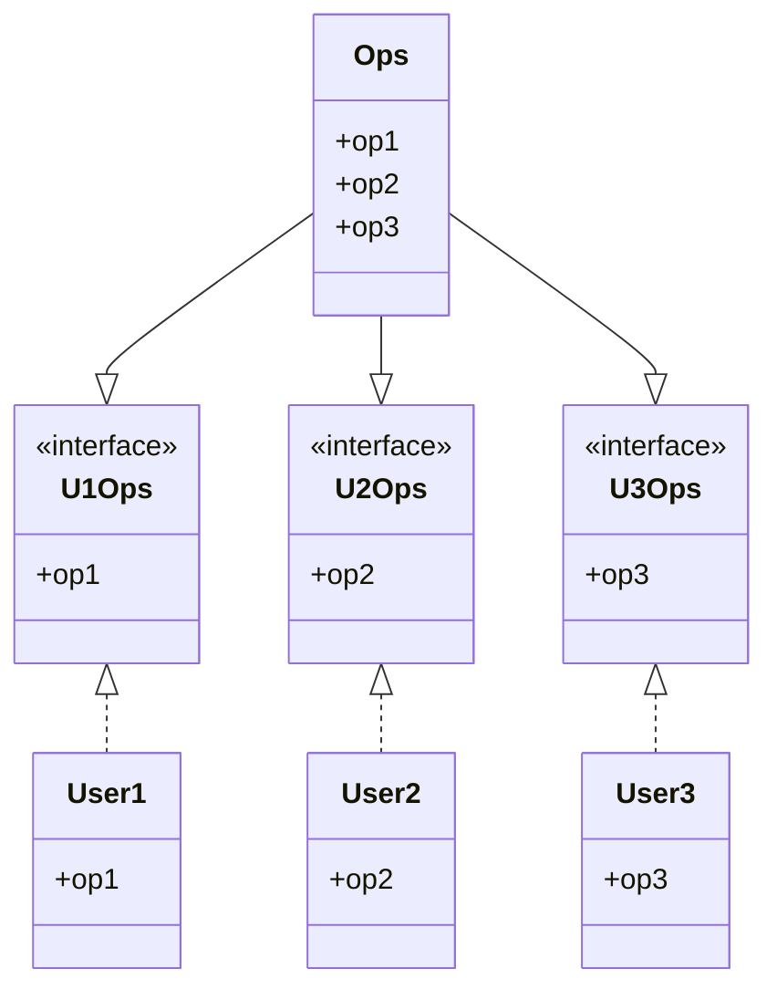
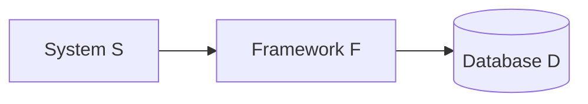

![[Pasted image 20250119132245.png]]
- OPS가 정적 타입 언어인 경우
	- User1에서 op2, op3을 사용하지 않지만, 이 두 메서드에 의존하게 됨
	- OPS 클래스에서 op2의 소스 코드가 변경되면 USer1을 다시 컴파일한 후 새로 배포해야함

- User1은 U1Ops, op1에는 의존하지만 OPS에는 의존하지 않음
- OPS에서 변경이 발생해도 User1에 관계 없는 변경이라면 User1을 재컴파일할 필요가 없음

## ISP와 언어
- 정적 타입 언어는 사용자가 import, user 또는 include와 같은 타입 선언을 사용하도록 강제
	- 소스 코드 의존성으로 인해 재컴파일, 재배포가 강제되는 상황이 무조건 발생한다
- 동적 타입 언어는 런타임 시 추론이 발생해 소스 코드 의존성이 아예 없고, 그래서 재컴파일과 재배포가 필요 없다
- **이로 인해 ISP를 아키텍처가 아니라, 언어와 관련된 문제라고 결론내릴 여지가 있다**

## ISP와 아키텍처
- 아키텍처에서도 의존적 구로 인해 불필요한 재컴파일, 재배포 같은 것이 강제된다

