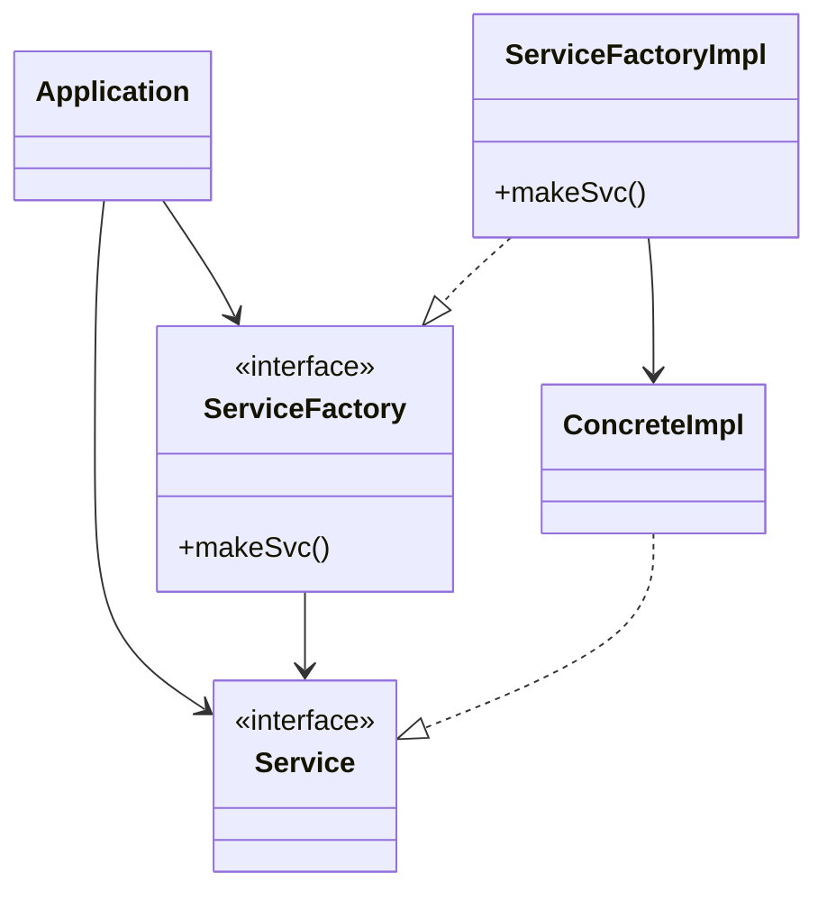

>[!important]
>우리가 의존하지 않도록 피하고자 하는 것은 변동성이 큰 구체적인 요소다
>그리고 이 구체적인 요소는 우리가 열심히 개발하는 중이라 자주 변경될 수 밖에 없는 모듈들이다

## 안정된 추상화
- 추상 인터페이스에 변경이 생ㅇ기면 이를 구체화한 구현체들도 따라서 숭정해야한다.
- 반대로 구체적인 구현체에 변경이 생기더라도 그 구현체가 구현하는 인터페이스는 대다수의 경우 변경될 필요가 없다
- **즉, 인터페이스는 구현체보다 변동성이 낮다**
- **안정된 소프트웨어 아키텍처란 변동성이 큰 구현체에 의존하는 일은 지양하고, 안정된 추상 인터페이스를 선호하는 아키텍처라는 의미이다**
- 안정된 소프트웨어 아키텍처를 만드는 코딩 실천법
	- **변동성이 큰 구체 클래스를 참조하지 말라**
		- 대신 추상 인터페이스를 참조하라.
		- 이 규칙은 언어가 정적 타입이든 동적 타입이든 관계없이 모두 적용
		- 이 규칙은 객체 생성 방식을 강하게 제약하며, 일반적으로 추상 팩토리를 사용하도록 강제한다
	- **변동성이 큰 구체 클래스로부터 파생하지 말라**
		- 정적 타입 언어에서 상속은 소스 코드에 존재하는 모든 관계 중 가장 강력한 동시에 변경이 어렵다
		- 따라서 상속은 아주 신중하게 사용해야 한다
	- **구체 함수를 오버라이드 하지 말라**
		- 대체로 구체 함수는 소스 코드 의존성을 필요로 한다. 따라서 구체 함수를 오버라이드하면 이런 의존성을 제거할 수 없게 되며, 실제로 그 의존성에 상속하게 된다
		- 이런 의존성을 제거하려면, 차라리 추상 함수로 선언하고 구현체들에서 각자의 용도에 맞게 구현해야 한다
	- **구체적이며 변동성이 크다면 절대로 그 이름을 언급하지 말라**
		- DIP의 다른 이름

## 팩토리
- 추상 팩토리 패턴

- Application은 Service 인터페이스를 통해 ConcreteImple을 사용하지만, Application에서는 어떤 식으로든 ConreteImpl의 인스턴스 생성
- ConcreteImple에 의존성이 생기지 않으면서 Application은 ServiceFactory 인터페이스의 makeSvc 메서드를 호출
- 이 메서드는 ServiceFactoryImpl에서 구현
- ServiceFactoryImpl 구현체가 ConcreteImpl의 인스턴스 생서 후 Service  타입으로 반환
- **소스 코드 의존성은 제어흐름과는 반대 방향으로 역전**
	- **의존성 역전**

## 구체 컴포넌트
- 위의 패턴에서 ServiceFactoryImpl 구체 클래스가 ConcreteImpl 구체 클래스에 의존
	- 즉 의존성 역전을 위반하지만, DIP 위배를 모두 없앨 수는 없다
	- 하지만 DIP를 위배하는 클래스들은 적은 수의 구체 컴포넌트 내부로 모을 수는 있다
- 