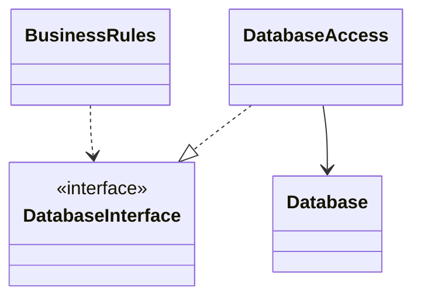

>[!note]
>소프트웨어 아키텍처는 선을 긋는 기술이며, 나는 이러한 선을 경계(boundary)라고 부른다
>경계는 소프트웨어 요소를 서로 분리하고, 경계 한편에 있는 요소가 반대편에 있는 요소를 알지 못하도록 막는다
- 인적 자원의 효율을 떨어뜨리는 요인은 결합(coupling)
	- 시스템의 업무 요구사항 -> 유스케이스와 아무런 관련이 없는 결정
	- 프레임워크, 데이터베이스, 웹 서버, 유틸리티 라이브러리, 의존성 주입에 대한 결정 등
	- 좋은 시스템 아키텍처는 이런 결정에 의존하지 않는다
# 두 가지 슬픈 이야기
- 결론 - 거대한 일련의 도메인 객체 서비스를 너무 이른 시기에 채택함으로써 인적 시간에 대한 비용을 증대시켰다

# FitNesse
# 어떻게 선을 그을까? 그리고 언제 그을까?
- 관련이 있는 것과 없는 것 사이에 선을 긋는다
	- GUI는 업무 규칙과는 관련 없기 때문에, 데이터베이스는 GUI와는 관련이 없으므로, 이 사이들에는 반드시 선이 있어야 한다
	- 예시 - 인터페이스 뒤로 숨은 데이터베이스

- BusinessRules는 Database Interface를 사용해 데이터를 로드하고 저장
- DatabaseAccess는 DatabaseInterface를 구현하며, Database를 실제로 조작하는 일을 수행
- Database는 BusinessRules에 대해 알고 있으나 그 반대는 알지 못한다
	- DatabaseInterface 클래스는 BusinessRules 컴포넌트에 속하며, DatabaseAccess 클래스는 Database 컴포넌트에 속한다는 의미
	- BusinessRules 에게 Database는 문제가 되지 않지만, Database는 BusinessRules 없이는 존재할 수 없다
	- BusinessRules에서는 어떤 종류의 데이터베이스로도 교체할 수 있다

# 입력과 출력은?
>[!note]
>입력과 출력은 중요하지 않다

- 사용자 경험은 인터페이스에 의해 좌우된다. 화면, 마우스 버튼, 음향 등이 그 인터페이스로 이 인터페이스 뒤에는 인터페이스를 조작하는 모델(데이터 구조와 함수로 구성된 정교한 집합)이 존재
- 더 중요한 사실은 모델은 인터페이스를 전혀 필요로 하지 않는다는 것 -> 게임이 화면에 전혀 출력되지 않더라도 모델은 게임에서 발생되는 모든 이벤트를 모델링하면서 주어진 역할을 충실히 수행

# 플러그인 아키텍처
- 업무 규칙에 플러그인 형태로 연결하기
![[Drawing 2025-02-02 14.00.45.excalidraw]]
- 사용자 인터페이스는 플러그인 형태로 고려
	- 수많은 종류의 사용자 인터페이스를 플러그인 형태로 연결 가능
	- 데이터베이스도 플러그인 형태로 연결 가능

# 플러그인에 대한 논의
- 시스템을 플러그인 아키텍처로 배치함으로써 변경이 전파될 수 없는 방화벽을 생성할 수 있다
	- GUI가 업무 규칙에 플러그인 형태로 연결되면 GUI에서 발생한 변경은 절대로 업무 규칙에 영향을 미칠 수 없다

