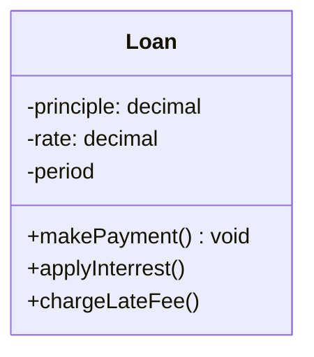

>[!note]
>업무 규칙은 사업적으로 수익을 얻거나 비용을 줄일 수 있는 규칙 또는 절차
>핵심 업무 규칙은 사업 자체에 핵심적이며, 규칙을 자동화하는 시스템이 없더라도 업무 규칙이 그대로 존재하는 규칙
>핵심 업무 규칙은 보통 데이터를 요구한다. 이를 핵심 업무 데이터라고 한다

# 엔티티
- 엔티티
	- 컴퓨터 시스템 내부의 객체로서, 핵심 업무 데이터를 기반으로 동작하는 일련의 조그만 핵심 업무 규칙을 구체화
	- 액심 업무 데이터를 직접 포함하거나 핵심 업무 데이터에 매우 쉽게 접근할 수 있다
	- 엔티티의 인터페이스는 핵심 업무 데이터를 기반으로 동작하는 핵심 업무 규칙을 구현하는 함수들로 구성
	- 예시

- 이 클래스는 데이터베이스, 사용자 인터페이스, 서드파티 프레임워크에 대한 고려사항들로 인해 오염되어서는 안된다
- 이 클래스는 어떤 시스템에서도 업무를 수행할 수 있으며, 시스템의 표현 형식이나 데이터 저장 방식, 해당 시스템에서 컴퓨터가 배치되는 방식과는 무관

# 유스케이스
- 유스케이스
	- 자동화된 시스템이 사용되는 방법을 설명
	- 사용자가 제공해야 하는 입력, 사용자에게 보여줄 출력, 해당 출력을 생성하기 위한 처리 단계를 기술
	- 애플리케이션에 특화된 업무 규칙을 설명
	- 엔티티 내부의 핵심 업무 규칙을 어떻게, 그리고 언제 호출할지를 명시하는 규칙을 담는다
	- 사용자 인터페이스를 기술하지 않는다
		- 유스케이스만으로 애플리케이션이 웹을 통해 전달되는지, 리치 클라이언트인지, 콘솔 기반인지, 순수한 서비스 인지 구분할 수 없다
		- **즉, 유스케이스는 시스템이 사용자에게 어떻게 보이는지를 설명하지 않는다**
	- 유스케이스는 객체
	- 애플리케이션에 특화된 업무 규칙을 구현하는 하나 이상의 함수를 제공
	- 입력 데이터, 출력 데이터, 유스케이스가 상호작용하는 엔티티에 대한 참조 데이터 등의 데이터 요소를 포함
- 엔티티는 자신을 제어하는 유스케이스에 대해 아무것도 알지 못한다
	- 엔티티는 고수준, 유스케이스는 저수준
		- 유스케이스는 단일 애플리케이션에 특화 -> 해당 시스템의 입력과 출력에 엔티티보다 가까움
		- 엔티티는 수많은 다양한 애플리케이션에서 사용될 수 있도록 일반화된 것
		- **유스케이스는 엔티티에 의존한다** 
		- **엔티티는 유스케이스에 의존하지 않는다**
# 요청 및 응답 모델
- 제대로 구성된 유스케이스 객체라면 데이터를 사용자나 또 다른 컴포넌트와 주고 받는 방식에 대해 전혀 눈치챌 수 없어야 한다
- 유스케이스는 단순한 요청 데이터 구조를 입력으로 받아들이고, 단순한 응답 데이터 구조를 출력으로 반환
	- 이 데이터 구조는 HttpRequest, HttpResponse 같은 표준 프레임워크 인터페이스로부터 파생되지 않는다
- 요청 및 응답 모델이 독립적이지 않다면, 그 모델에 의존하는 유스케이스도 결국 해당 모델이 수반하는 의존성에 간접적으로 결합되어 버린다