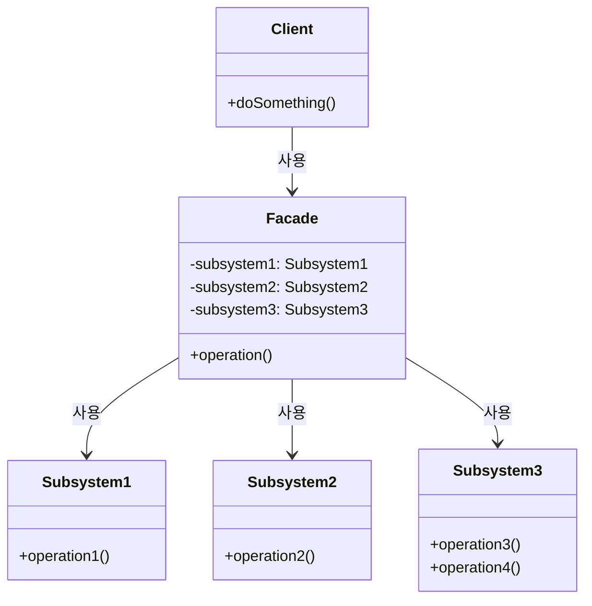

# 마지막 단계를 건너뛰기
- 부분적 경계를 생성하는 방법
	- 독립적으로 컴파일하고 배포할 수 있는 컴포넌트를 만들기 위한 작업을 모두 수행한 후, 단일 컴포넌트에 그대로 모아만 두는 것
		- 쌍방향 인터페이스도 그 컴포넌트에 있고, 입력-출력 데이터 구조도 그곳에 있음
		- 단일 컴포넌트로 컴파일해서 배포

# 일차원 경계
- 전략 패턴(strategy pattern)
![[Pasted image 20250301133721.png]]
-  완벽한 형태의 아키텍처 경계를 양방향으로 격리된 상태를 유지하기 위해 쌍방향 Boundary 인터페이스 사용
- Client를 ServiceImpl로부터 격리시키는 데 필요한 의존성 역전이 이미 적용되어 있음
- 이 구조에선 경계가 금방 흐트러질 수 있음 -> client가 직접 Service Impl을 호출 할 수 있는 상태

# 퍼사드

- 의존성 역전도 희생
- 경계는 Facade 클래스로만 간단히 정의
- Facade 클래스에는 모든 서비스 클래스를 메서드 형태로 정의하고, 서비스 호출이 발생하면 해당 서비스 클래스로 호출을 전달
- Client가 이 모든 서비스 클래스에 대해 추이 종속성을 가지게 됨
	- 정적 언어라면 서비스 클래스 중 하나에서 소스 코드가 변경되면 Client도 무조건 재컴파일 해야함