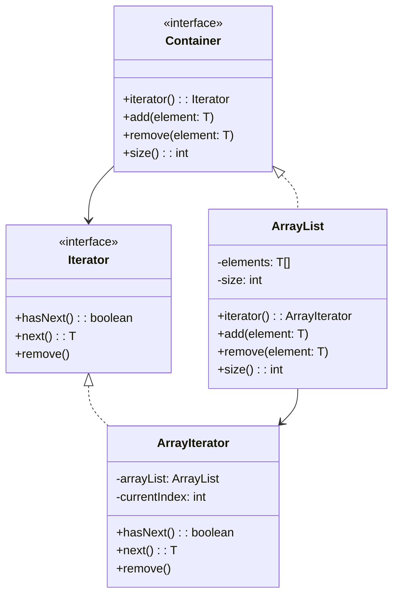

Container 클래스와 Iterator 클래스의 Common Reuse Principle (CRP) 예시를 상세히 설명해드리겠습니다:



### CRP(Common Reuse Principle) 설명
1. **강한 결합성**
   - Container와 Iterator는 함께 재사용되는 인터페이스 쌍입니다
   - 컨테이너를 사용하려면 반드시 이터레이터가 필요하며, 이터레이터는 컨테이너 없이는 의미가 없습니다

2. **패키지 구성**
   ```
   com.example.collection/
   ├── container/
   │   ├── Container.java
   │   └── Iterator.java
   └── impl/
       ├── ArrayList.java
       └── ArrayIterator.java
   ```
   - 강하게 결합된 인터페이스들은 같은 패키지에 위치
   - 구현체들은 별도의 패키지에 위치

3. **사용 예시**
   ```java
   // Container와 Iterator는 항상 함께 사용됨
   Container<String> container = new ArrayList<>();
   container.add("A");
   container.add("B");
   container.add("C");

   Iterator<String> iterator = container.iterator();
   while(iterator.hasNext()) {
       String element = iterator.next();
       System.out.println(element);
   }
   ```

4. **CRP 적용의 이점**
   - **일관된 변경**: Container 인터페이스가 변경되면 Iterator도 함께 변경
   - **재사용성**: 두 인터페이스를 함께 재사용하므로 의존성 관리가 용이
   - **유지보수**: 관련된 컴포넌트들이 함께 패키징되어 있어 변경 관리가 쉬움

5. **확장 예시**
   ```java
   // LinkedList 구현
   class LinkedList<T> implements Container<T> {
       private Node<T> head;
       
       @Override
       public Iterator<T> iterator() {
           return new LinkedListIterator<>(this);
       }
   }

   class LinkedListIterator<T> implements Iterator<T> {
       private Node<T> current;
       
       public LinkedListIterator(LinkedList<T> list) {
           this.current = list.head;
       }
   }
   ```

6. **CRP 위반 사례**
   ```java
   // 잘못된 예: Iterator 없이 Container만 사용
   class BadContainer<T> {
       private T[] elements;
       
       public T[] getElements() {  // 내부 구현을 직접 노출
           return elements;
       }
   }
   ```

7. **테스트 용이성**
   ```java
   class ContainerTest {
       @Test
       void testIterator() {
           Container<Integer> container = new ArrayList<>();
           container.add(1);
           container.add(2);
           
           Iterator<Integer> iterator = container.iterator();
           assertTrue(iterator.hasNext());
           assertEquals(1, iterator.next());
       }
   }
   ```

### CRP 적용시 주의사항
1. **인터페이스 분리**
   - Container와 Iterator는 각각 독립적인 인터페이스로 유지
   - 하지만 패키지 레벨에서는 함께 제공

2. **구현체 분리**
   - 구현체들은 별도 패키지에 위치
   - 사용자는 인터페이스만 알면 됨

3. **변경 관리**
   - 두 인터페이스 중 하나가 변경될 때 다른 하나도 검토
   - 변경이 미치는 영향을 함께 고려

이러한 설계는 컬렉션 프레임워크에서 널리 사용되는 패턴이며, Java의 Collection Framework도 이와 유사한 구조를 가지고 있습니다.