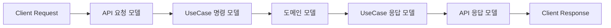

# 엔티티, 유스케이스, 요청 및 응답 모델 정리

## 1. 기본 구조 예시 (도서관 시스템)

### 1.1 엔티티 (Entity)
```java
@Entity
public class Book {
    @Id
    @GeneratedValue(strategy = GenerationType.IDENTITY)
    private Long id;
    
    private String isbn;
    private String title;
    private String author;
    private LocalDateTime createdAt;
    private boolean available;
    
    // 비즈니스 로직
    public void borrowBook() {
        if (!available) {
            throw new IllegalStateException("이미 대출 중인 도서입니다.");
        }
        this.available = false;
    }
    
    public void returnBook() {
        this.available = true;
    }
}
```

### 1.2 유스케이스 (UseCase)
```java
@Service
public class BorrowBookUseCase {
    private final BookRepository bookRepository;
    private final LoanRepository loanRepository;
    
    @Transactional
    public BorrowBookResponse execute(BorrowBookCommand command) {
        Book book = bookRepository.findById(command.getBookId())
            .orElseThrow(() -> new BookNotFoundException(command.getBookId()));
            
        book.borrowBook();
        
        Loan loan = new Loan(
            book,
            command.getUserId(),
            LocalDateTime.now(),
            LocalDateTime.now().plusDays(14)
        );
        
        loanRepository.save(loan);
        
        return new BorrowBookResponse(
            loan.getId(),
            book.getTitle(),
            loan.getDueDate()
        );
    }
}
```

### 1.3 요청 모델 (Request Model)
```java
public class BorrowBookCommand {
    @NotNull
    private Long bookId;
    
    @NotNull
    private Long userId;
}

public class BorrowBookRequest {
    @NotNull
    private Long bookId;
    
    public BorrowBookCommand toCommand(Long userId) {
        return new BorrowBookCommand(this.bookId, userId);
    }
}
```

### 1.4 응답 모델 (Response Model)
```java
public class BorrowBookResponse {
    private Long loanId;
    private String bookTitle;
    private LocalDateTime dueDate;
}

public class ApiResponse<T> {
    private String status;
    private T data;
    private String message;
    
    public static <T> ApiResponse<T> success(T data) {
        return new ApiResponse<>("success", data, null);
    }
}
```

## 2. 프로젝트 구조와 연결 관계

### 2.1 패키지 구조
```
src/main/java/com/example/project/
├── domain/
│   └── book/
│       ├── entity/
│       │   └── Book.java
│       ├── repository/
│       │   └── BookRepository.java
│       └── exception/
│           └── BookNotFoundException.java
│
├── application/
│   └── book/
│       ├── command/
│       │   └── BorrowBookCommand.java
│       ├── response/
│       │   └── BorrowBookResponse.java
│       └── service/
│           └── BorrowBookUseCase.java
│
└── interfaces/
    └── api/
        └── book/
            ├── dto/
            │   ├── request/
            │   │   └── BorrowBookRequest.java
            │   └── response/
            │       └── ApiResponse.java
            └── BookController.java
```

### 2.2 데이터 흐름


### 2.3 계층별 역할

#### 2.3.1 API 계층 (interfaces)
- 외부 요청 데이터 검증
- API 응답 형식 표준화
- 요청/응답 데이터 변환

#### 2.3.2 애플리케이션 계층 (application)
- UseCase 실행에 필요한 입력 데이터 정의
- UseCase 실행 결과 데이터 정의
- 비즈니스 로직 조정

#### 2.3.3 도메인 계층 (domain)
- 비즈니스 핵심 로직 포함
- 도메인 규칙 및 제약조건 관리
- 상태 관리

### 2.4 장점
1. **계층 분리**
   - 각 계층의 독립적인 모델 관리
   - 계층 간 의존성 최소화

2. **유연성**
   - API 변경이 내부 로직에 영향 최소화
   - 도메인 로직 변경이 API에 영향 최소화

3. **테스트 용이성**
   - 계층별 독립적 테스트 가능
   - 모델 변환 로직 검증 용이

4. **명확한 책임**
   - 각 모델의 특정 계층 관심사 처리
   - 단일 책임 원칙 준수