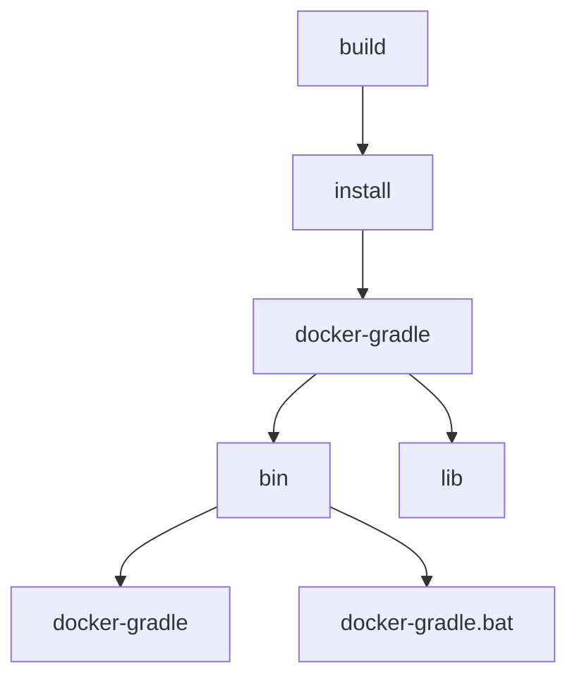

## 12.1 기본기가 탄탄한 개발자에게 컨테이너가 중요한 이유
### 12.1.1 호스트 운영체제 vs 가상머신 vs 컨테이너
- 베어 메탈(==bare metal machine==)
	- 호스트 운영체제가 설치되지 않은 기본
- 호스트 운영체제 또는 타입 1 하이퍼바이저
	- 하이퍼바이저(hypervisor)
		- 가상머신을 생성하고 관리할 수 있는 소프트웨어
		- VMWare ESXi, Hyper-V
	- 타입 1 하이퍼바이저
		- 베어 메탈에 설치
		- 경량 OS 역할
		- 머신의 리소스 대부분을 실행 중인 가상머신에 할당
		- 호스트 운영체제를 실행하려면 일부 CPU, RAM, 네트워킹이 필요
- 타입 2 하이퍼바이저
	- 타입 1 하이퍼바이저, 타입 2 하이퍼바이저 모두 게스트 운영체제를 사용하는 가상머신의 기본 하드웨어 리소스를 관리
- 가상머신(virtual machine)
	- 독립적
	- 게스트 운영체제라는 자체 운영체제가 있다
- 컨테이너 엔진
	- 게스트 운영체제상에서 컨테이너 엔진을 실행하는 것이 일반적
	- 컨테이너 엔진은 그 자체로 여러 컨테이너를 실행할 수 있음
	- 컨테이너 엔진의 주요 책임 중 하나는 실행 중인 컨테이너 간에 단일 운영체제 커널에 대한 액세스를 공유하는 것
- 컨테이너
	- 애플리케이션을 실행하기 위해 사용자 정의로 구축하고 격리된 환경
	- 파일시스템, 하나 이상의 프로세스를 실행
	- 컨테이너의 프로세스는 모두 커널과 통신할 수 있지만 메모리, CPU, 네트워크(사용량 및 가시성), 디스크에 대한 제한을 포함해 컨테이너를 나머지 세계와 분리하기 위해 많은 제한을 부과
	- 전용 컨테이너 엔진의 자바 애플리케이션의 대상 환경![[Pasted image 20241111093741.png]]
### 12.1.2 컨테이너의 이점
- 컨테이너의 이점
	- 실행 중인 개별 프로세스를 서로 격리할 수 있는 능력
		- 과거에는 동일한 호스트에 두 개의 자바 애플리케이션을 배포하면 서로의 성능을 방해해 CPU 시간을 너무 많이 빼앗거나 정당한 몫 이상의 메모리를 사용
	- 컨테이너는 배포를 위해 일관된 패키징 수행
		- 이전에는 애플리케이션의 바이트들을 배포 환경에 복사하는 것, 운영체제 의존성을 관리하는 것, 프로세스 시작 관리까지 모두 제각각
		- 컨테이너가 이 모든 것의 해답을 제공하므로 많은 양의 도구와 사용자 정의 스크립트가 필요하지 않다
	- 배포 환경과 컨테이너의 콘텐츠 사이에 단열 기능 제공
		- 컨테이너 엔진은 컨테이너 내부를 어떻게 배치할 지 신경 쓸 필요 없이 요청이 있을 때 스스로 시작하는 방법만 알면 된다
	- 일관된 패키징으로 인해 형성된 컨테이너 주변의 생태계

### 12.1.3 컨테이너의 단점
- 컨테이너의 단점
	- 컨테이너 외부에서 컨테이너로 이동할 때 특별한 처리와 환경 구성이 필요할 수도 있음
	- 컨테이너에서 애플리케이션을 패키징하고 시작하는 방법에 일관된 인터페이스를 제공하지만, 실제 배포는 쉽지 않다

## 12.2 도커 기본
### 12.2.1 도커 이미지 빌드하기
- 도커 이미지
	- 실제로 소프트웨어를 실행하는 데 필요한 모든 파일시스템 의존성을 포착한 스냅숏
	- 네이티브 라이브러리, 프로그래밍 언어 실행 환경, 도구, 특정 버전의 소프트웨어 포함
- 빌드 방법
```bash
$ docker build
```

### 12.2.2 도커 컨테이너 실행하기
- 도커 컨테이너 실행 방법
```bash
$ docker run hello
```

## 12.3 도커로 자바 애플리케이션 개발하기
### 12.3.1 기본 이미지 선택
- 이미지 선택 시 고려 사항
	- 어떤 벤더를 원하는가?
	- 컨테이너 내부에 어떤 운영체제를 원하는가?
	- 어떤 시스템 아키텍처에서 실행해야 하는가?
- 벤더 선택 시 고려 사항
	- 지원 가용성과 계약
	- 보안 업데이트 정책과 적시성
	- 클라우드 배포에 대한 특별 고려 사항
- 특별한 OS 요구 사항이 없는 경우 Debian/Ubuntu와 같은 더 보편적인 옵션이 수월함

### 12.3.2 그래들로 이미지 빌드하기
- ==$./gardlew installDist== 의 빌드 결과



### 12.3.3 도커에서 빌드하기
- 다단계 빌드(bultistage build)
	- 도커의 동일한 파일에 대한 여러 이미지 정의 및 파일 간 복사를 사용해 로컬 시스템에 있는 JDK를 완전히 제거한 채 애플리케이션을 빌드한 이미지를 구성하고 배포 이미지로 복사하는 것
	- 예시
```yaml
FROM eclipse-temurin:17-jdk AS build

RUN mkdir /project
WORKDIR /project

COPY . .

RUN ./gradlew clean installDist

FROM eclipse-temurin:17-jre

RUN mkdir /opt/app

COPY --from=build \
		/project/build/install/docker-gradle-multi \
		/opt/app

WORKDIR /opt/app/bin
CMD ["./docker-gradle-multi"]
```
- dockerignore
```markdown
.git
.idea/
*.iml
*.class

#Ignore build folders
out/
build/
target/
.gradle/
```
	- 해당 파일들을 도커가 무시할 수 있기 하는 것
- 이미지 구축 시 gradle 최적화
```yaml
// 그래플 구성을 실행하는 데 필요한 부분만 복사
COPY ./gradle ./gradle 
COPY ./gradlew* ,/settings.gardle* .
// ./gradlew를 단독으로 실행 시 배포본이 강제로 다운로드
// 이 방법을 사용하면 자체 레이어에 캐시
RUN ./gradlew

// 변경본 마다 확실하게 갱신될 것
COPY . . 

RUN ./gradlew clean installDist
```

### 12.3.4 포트와 호스트
- docker 포트 
	- 포트 지정
```bash
$ docker run -p 8080:8080 hello
```
	- -p : 포트 지정
	- 8080:8080
		- 첫 번째 값은 컨테이너 외부에서 사용할 수 있는 포트
		- 두 번째 값은 컨테이너 내부의 소프트웨어가 수신 대기 중인 포트
- docker 호스트
	- 맥, 윈도우용
		- ==host.docker.internal== 사용
	- 리눅스용 
		- ==--add-host host.docker.internal:host-gateway==
### 12.3.5 docker 컴포즈를 사용한 로컬 개발
- docker compose
	- 컨테이너 세트를 선언하고 실행하는 도구
	- 단일 컴퓨터에서 실행되도록 설계되어, 많은 프로덕션 환경에서 합리적인 선택이 아니다
	- 예시
```yaml
version: "3.9"
services:
	app:
		build: .
		ports:
			: "8080:8080"
	redis:
		image: "redis:alpine"
```

### 12.3.6 도커에서의 디버깅
- ==-name container-name== 
	- 컨테이너 이름 지정하기
- ==docker exec==
	- 실행 중인 컨테이너에 명령 내리기
		![[Drawing 2024-11-11 10.59.14.excalidraw]]
### 12.3.7 도커로 로깅하기
- 컨테이너 내 로그를 간단히 로컬 파일에 설정한다면, 컨테이너 내에 추가적인 메모리와 리소스가 소비되므로, 하나의 컨테이너 내에 여러 가지 요소를 가지는 것을 피하기를 궎장
- 대안으로 도커 컨테이너의 일반 출력 스트림인 ==STDOUT & STDERR==에 작성하는 모든 내용을 캡처하는 것을 활용하는 것
	- 호스트에 이런 스트림이 실행되는 모든 컨테이너가 잘 알려진 파일 위치에 저장됨

## 12.4 쿠버네티스
- kubernetes
	- 컨테이너 오케스트레이션
	- 시스템에 대해 원하는 상태를 설명한 다음, 시간이 지나도 해당 상태가 유지되도록 보장하는 표준 API 기반 도구
	- 용어
		- cluster
			- 단일 머신에서 수백 개의 노드까지 모든 것이 쿠버네티스를 한 번만 설치하면 된다
		- node
			- 클러스터 내의 단일 머신(가상 또는 물리적)
		- pod
			- 하나 이상의 컨테이너로 구성된 배포 가능한 단위
		- deployment
			- 팟을 배포하는 선언적 방법
		- service
			- 클러스터의 컨테이너를 호출자에게 노출하는 오브젝트
	- 하나의 팟이 실행 중인 쿠버네티스 클러스터
		![[Drawing 2024-11-11 11.20.08.excalidraw]]
- ==kubectl expose deployment echoes --type=NodePort --port=8080==
![[Pasted image 20241111112510.png]]

## 12.5 관측 가능성과 성능
### 12.5.1 관측 가능성
>[!note]
>관측 가능성 기능의 핵심은 "쿼리 및 시각화"


- 관측 가능성(observability)
	- Devops의 관행
	- 애플리케이션 성능 모니터링, 오케스트레이션된 시스템에 대한 가시성의 필요성 등 여러 가지 최신 개발 관행에서 비롯된 것 
	- 시스템과 애플리케이션을 계측해 관련 데이터를 수집
	- 이 데이터를 저장하고 분석(쿼리 기능을 포함)할 수 있는 시스템으로 전송
	- 전체 시스템에 대한 시각화와 통찰력을 제공
	- 기존 on-premise 애플리케이션 보다 복잡함
	- 관측 가능성의 세 가지 기둥
		- 분산 추적(distributed trace)
			- 단일 사용자 요청에 해당하는 단일 서비스 호출 레코드
		- 메트릭(metric)
			- 시간 간격 내의 특정 활동을 측정하는 값
		- 로그(log)
			- 시간이 지나면서 발생하는 각 사건을 기록한 것으로, ㅎ나 번 기록되면 변경되지 않는다
- 오픈텔레메트리(OpenTelemetry)
	- 시스템 상태를 모니터링하고 이해하기 위한 표준, 형식, 클라이언트 라이브러리 및 관련 소프트웨어 컴포넌트들의 집합
	- 오픈텔레메트리 자바 라이브러리는 수동적인 방법(==개발자가 애플리케이션의 계측이 필요한 부분을 신중하게 선택해야 하는 경우==) 또는 자동 계측 사용(==자바 에이전트 사용==) 중 하나를 선택해 애플리케이션에 배포

### 12.5.2 컨테이너에서의 성능
- 많은 개발자가 자신의 자바 애플리케이션을 컨테이너로 마이그레이션할 때 가능한 한 작은 컨테이너를 사용하려고 한다. 하지만 JVM은 매우 동적인 플랫폼이어서, 중요한 매개변수 중 일부는 JVM이 실행되는 머신의 특성을 바탕으로 JVM이 시작될 때 자동으로 결정
- JVM의 동적인 특성
	- JVM 내재적 특성, 특정한 CPU 기능(==벡터 지원==)을 활용할 수 있는 JIT 기술
	- 내부 스레드 풀 크기 설정
	- 가비지 컬렉션에 사용되는 스레드 수
- 컬렉터가 지정되지 않았을 때 GC를 결정하는 로직
	- 현재 자바의 버전 & 17버전포함
	- 몇 가지 동적 검사 후 GC 선택
	- 기계가 서버급이라면 G1(자바 8용 병렬 컬렉터)
	- 기계가 서버급이 아니라면 Serial 선택


